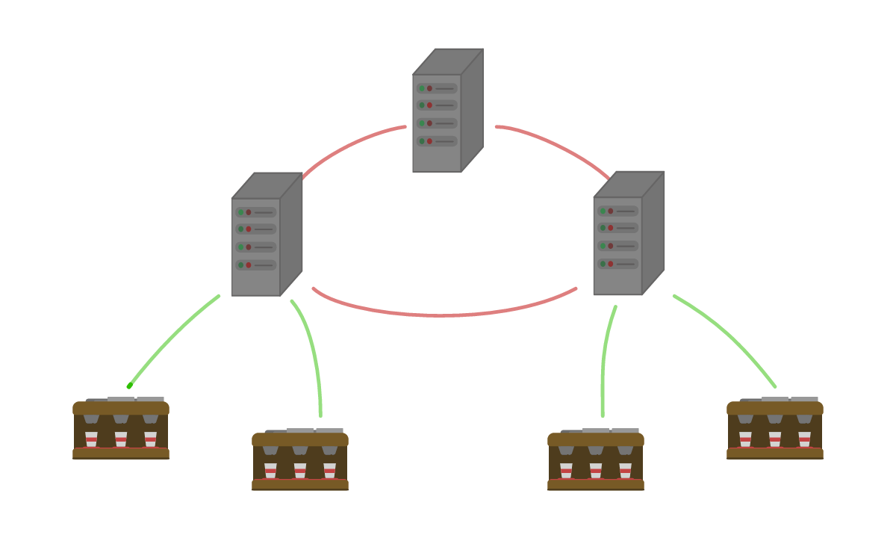
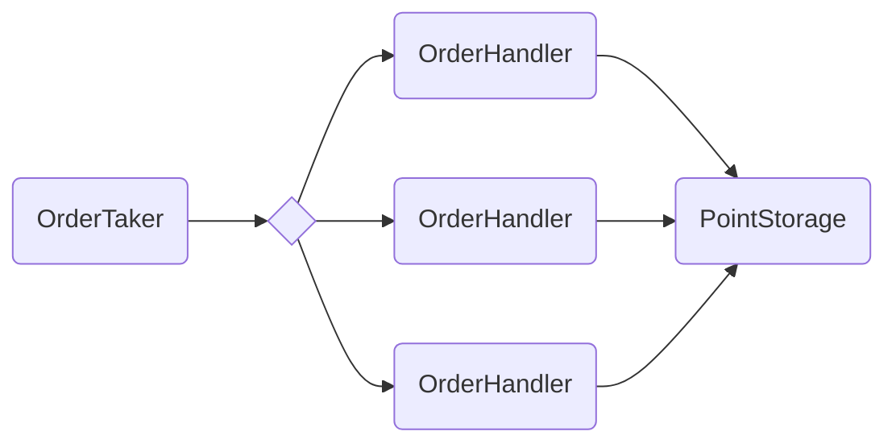
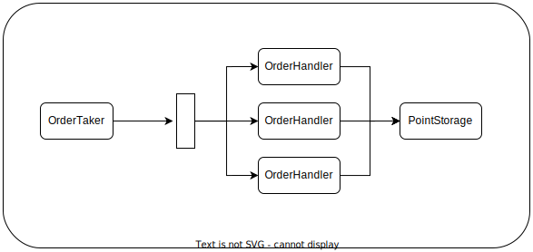
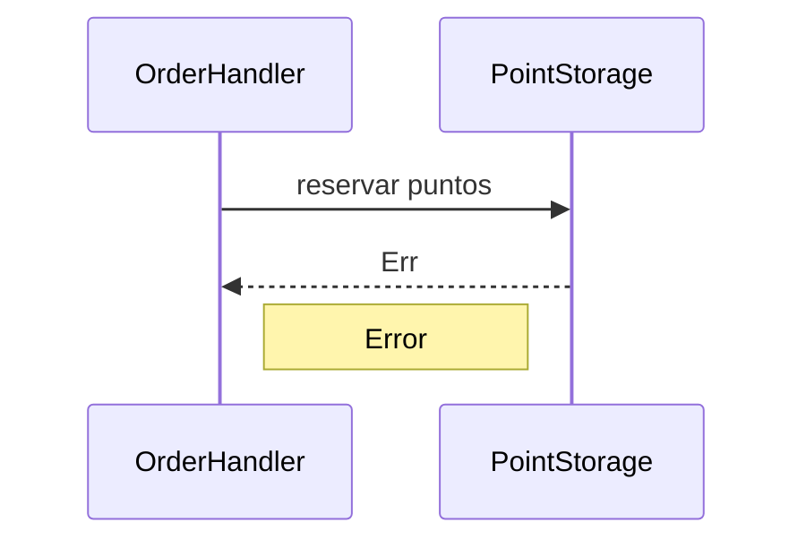
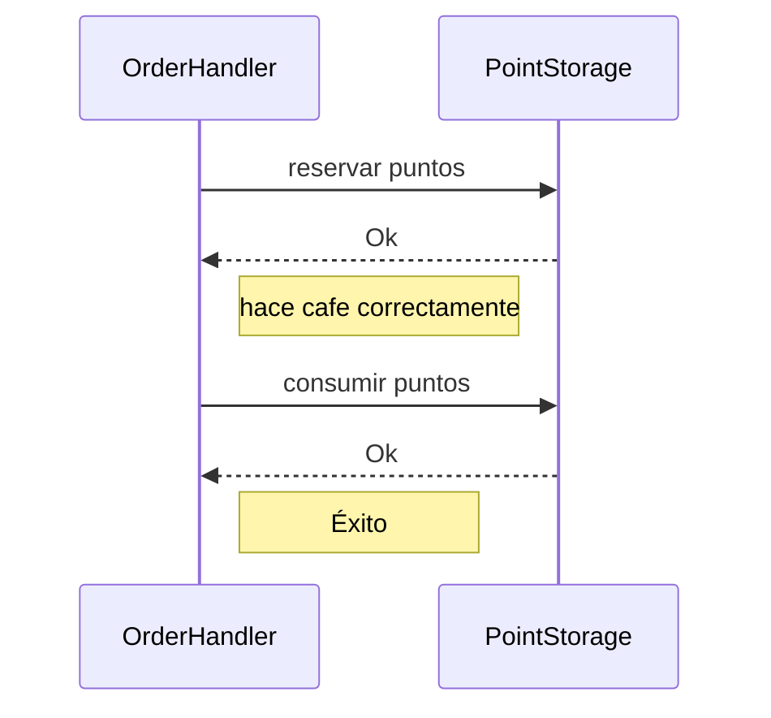
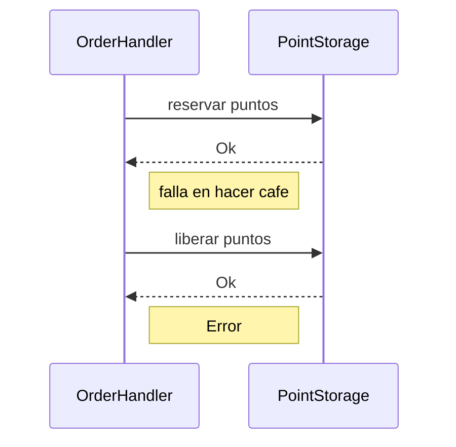
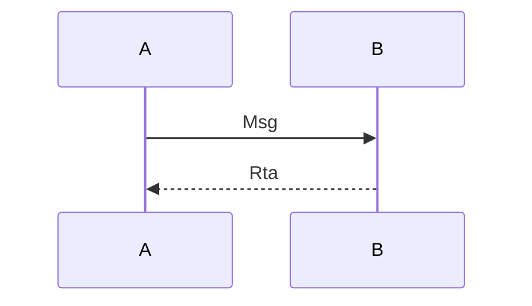

<h1>
Coffeewards

</h1>

Coffeewards, es un sistema de puntos para fidelización de los clientes.

Por cada compra que realizan los clientes, suman puntos que luego pueden canjear por cafes gratuitos.

<!--
- [ ] explicación del diseño y de las decisiones tomadas para la implementación
- [ ] diagramas de threads y procesos, y la comunicación entre los mismos
- [ ] diagramas de las entidades principales
-->

## Diseño

### Arquitectura

<!--
- resumen de arquitectura
- cliente-servidor ( coffee_maker-server )
- txs distribuidas en servidores
- puntos disponibles/reservados -> 2txs de uso simultaneas
- supuestos -> los servers locales no pierden conexión con la cafetera
> Detalles de implementación
-->

El sistema se implementa como una arquitectura **cliente-servidor**, donde las cafeteras se conectan a su servidor local para sumar o usar puntos a medida que recibe pedidos.

Los **servidores** se comunican entre si para mantener consistente el estado de las cuentas de forma **distribuida**. Esto se implementa mediante **transacciones en 2 fases**.

Se distinguen 4 acciones principales:

- **Reservar** puntos `Lock`
- **Soltar** puntos reservados `Free`
- **Consumir** puntos reservados `Consume`
- **Añadir** puntos `Add`

Para reservar puntos se **requiere** que por lo menos la **mitad** de los servidores estén **disponibles**.
En cambio, las otras transacciones ( asumiendo que los puntos fueron previamente reservados si fuese necesario ) no deberían fallar y quedan pueden quedar pendientes hasta que sea posible resolverlas.

Al **procesar una orden**, primero se reservan los puntos necesarios y al finalizarla se añaden/liberan/consumen los puntos reservados.
La respectiva cuenta solo se bloquea mientras se procesan estas transacciones y no mientras se prepara el café, lo cual permite que se puedan procesar pedidos de una misma cuenta **concurrente**.

#### Supuestos

- Se asume que las cafeteras no pierden conexión con el servidor local.
- Se asume que los servidores pueden perder conexión con la red, pero siguen siendo parte de la misma durante toda la ejecución.
- Se asume que no habrá agentes externos al sistema que intenten afectarlo.
- El proceso del servidor no es interrumpido de manera inesperada.

### Cafetera `coffee_maker`

<!--
- esquema de actores
- diagrama de flujo de handle order
> Detalles de implementación
-->

El programa de la cafetera se encarga de recibir pedidos de los clientes de un archivo y procesar los.

Este se implementa utilizando un esquema de actores:

<!--

-->

- `OrderTaker`: Recibe los pedidos y los delega
- `OrderHandler`: Prepara los cafes. Hay uno por dispenser.
- `PointStorage`: Se encarga de las operaciones de puntos, comunicándose con el servidor local.

<h4>Detalles de Implementación</h4>

##### Error reservando puntos

##### Orden exitosa

##### Orden fallida

### Servidor local `server`

<!--
- como maneja clientes
- como maneja msgs ( con, sync, ping, tx )
- offline -> pending
> Detalles de implementación

-->

El servidor local se encarga tanto de recibir y procesar los mensajes de los **clientes** como de **comunicarse** con el resto de los **servidores** para mantener **consistente** el estado de las cuentas.

Toda la comunicación se realiza mediante **TCP**.

#### Servicio a Clientes

Cuando un cliente abre una conexión, el servidor crea un **hilo** para manejarla.
En este recibe **pedidos** (`order`) y los maneja secuencialmente hasta que el cliente se desconecta.
El servidor le **responderá** al cliente si el pedido fue exitoso o no.

#### Comunicación entre Servidores

Los servidores abren una **conexión** para cada comunicación con otro servidor.
Una comunicación entrante se resuelve en un nuevo **hilo** y puede implicar el intercambio de **varios mensajes**.

Los **tipos** de comunicación son:

- `PING`
  - Se utiliza para verificar si el servidor tiene conexión.
  - Secuencia: `PingRequest` , `PingResponse`
- `CONNECT`
  - Se utiliza para conectar un nuevo servidor a la red.
  - Secuencia: `ConnectRequest(new_server)` , `ConnectResponse(servers)`
- `SYNC`
  - Se utiliza para sincronizar el estado de las cuentas
  - Secuencia: `SyncRequest` , `SyncResponse(point_map)`
- `TRANSACTION`
  - Se utiliza para realizar una [transacción distribuida](#transacciones_distribuidas).

#### Perdida de Conexión

Cuando un servidor **no recibe respuesta de ningún otro** , tanto al realizar una transacción como al enviar pings, detecta que esta **desconectado**.

Por otro lado, **al recibir** algún mensaje o respuesta detecta que esta **conectado**.

Cuando una transacción falla, pero podría ser resuelta (eg. una carga de puntos estando desconectado) esta se guarda en una lista de **pendientes**,
que se intentan de procesar en un **hilo** dedicado.

Cuando el servidor se **desconecta** (conectado -> desconectado) **detiene** el procesamiento de pendientes.

Cuando el servidor se **reconecta** (desconectado -> conectado) se **sincroniza** con los demás servidores y **reanuda** el procesamiento de pendientes.

<h4 id="transacciones_distribuidas">Transacciones Distribuidas</h4>

Las transacciones se ejecutan en **2 fases**

##### Transacción Exitosa

<h4>Detalles de Implementación</h4>

##### Diagrama de Clases

### Controlador `controller`

<!--
- que es
> Detalles de implementación
-->

## Desarrollo

- `make` en el directorio raíz corre `fmt`, `test` y `clippy` para el espacio de trabajo.
- `coffee_maker <local_server> [<orders>]`
- `local_server <address> [<known_server_address>]`
- `controller`
  - `<Disconnect/Connect> <address>`

> las direcciones son de la forma `ip:puerto` o `puerto` (en cuyo caso se usa `localhost`)
